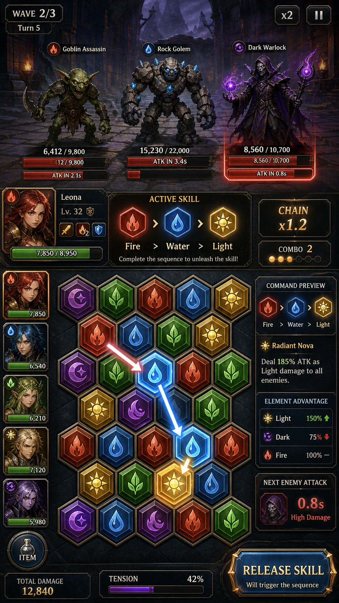

# ElementalCommand GDD 스냅샷

**작성일**: 2026-09-11 (KST) | **버전**: v0.10.2

## 1. 문제 정의 / 페르소나 / 코어 루프
- **문제**: Electron 기반 게임 프로젝트로 source/assets/tests 구조를 갖춤. 정확한 장르·핵심 문제 정의는 확인 필요.
- **페르소나**: 이름(Elemental Command)으로 미루어 전략/커맨드형 게임 팬으로 추정 (제안, 확인 필요).
- **코어 루프(제안)**: 유닛/원소 배치 → 명령 실행 → 결과 판정 → 다음 턴/웨이브. 실제 규칙은 확인 필요.

## 2. MVP / KPI / 참고 단계 및 교훈
- **MVP 범위**: v0.10.2까지 반복 개발됨 — 버전 히스토리상 다수 이터레이션 존재 시사(확인 필요, 정확한 변경 로그 미확인).
- **KPI**: 수치 데이터 없음 — 확인 필요.
- **참고 단계**: source/assets/tests 분리 구조 → 표준적 Electron 프로젝트 구성 확인됨.
- **교훈(제안)**: 버전이 0.10.2까지 진행된 만큼, 다음 단계에서는 콘텐츠 확장보다 핵심 루프 안정화가 우선일 가능성 — 로드맵 확인 필요.

## 3. 필러 / 컴포넌트 표
| 필러(제안) | 관련 컴포넌트 | 상태 |
|---|---|---|
| 전략적 명령 실행 | source/ | 확인 필요 |
| 시각/오디오 표현 | assets/ | 존재 확인, 세부 목록 확인 필요 |
| 안정성 | tests/ | 존재 확인 |

## 4. 확인된 사실 / 미확인 사항
- **확인됨**: 버전 v0.10.2, Electron 게임 프로젝트, source/assets/tests 존재.
- **미확인(확인 필요)**: 정확한 게임플레이 규칙, 콘텐츠 총량(원소/유닛/맵 수 등), 타겟 플랫폼 세부사항.

## 5. 페이싱 / 재미 사슬 / 예시 2개 / 피로도 / 경제 / 온보딩
- **페이싱(제안)**: 짧은 턴 단위로 긴장-이완 반복 구조 제안.
- **재미 사슬(제안)**: 계획(명령 준비) → 실행(원소 발동) → 피드백(결과 확인) → 최적화(다음 계획).
- **예시 1(제안)**: 화염 원소로 방어선 돌파 → 상대 반격 원소 대응.
- **예시 2(제안)**: 자원 제한 상황에서 원소 조합 선택 → 리스크/리턴 트레이드오프.
- **피로도(제안)**: 동일 원소 반복 사용 시 효율 저하 등 다양성 유도 장치 필요, 구현 여부 확인 필요.
- **경제(확인 필요)**: 자원/원소 획득-소비 밸런스 수치 불명.
- **온보딩(제안)**: 첫 판에서 원소 하나씩 순차 소개 후 조합 자유도 개방.

## 6. HUD 5가지 상태 / 접근성 / AV
- **HUD 상태(제안, 확인 필요)**: 대기 / 명령 입력 / 실행 중 / 결과 표시 / 오류·경고.
- **접근성**: 색맹 팔레트, 키 리매핑, 텍스트 스케일 — 구현 여부 확인 필요.
- **AV**:
  - **구현됨**: assets 폴더 존재로 기초 그래픽/사운드 자원 확보 (세부 확인 필요).
  - **계획됨**: 확인 필요.
  - **제안**: 원소별 시각 이펙트 차별화로 즉각적 피드백 강화.

## 7. 우선순위 3가지
1. v0.10.2 기준 실제 게임플레이 규칙 문서화(확인 필요 해소).
2. 콘텐츠 인벤토리(원소/유닛/맵 수) 정리.
3. 테스트 커버리지 점검 및 안정화 로드맵 수립.

# ELEMENT ADDENDUM

**버전**: v0.10.2 (Electron)
**구조**: source / assets / tests 존재 확인됨
**규칙·콘텐츠**: 미검증 (소스 상세 검토 전이므로 아래 항목은 원칙적으로 확인 필요로 표기)

## 구성요소

| 역할 | 선택 | 입력→판정→피드백 | 상태 |
|---|---|---|---|
| 확인 필요 | 확인 필요 | 확인 필요 | 확인 필요 |

## 콘텐츠 제공 방식

확인 필요 (콘텐츠 미검증으로 제공 방식·순서·분기 여부 특정 불가)

## 세션 구조

### 30초
확인 필요

### 5분
확인 필요

### 30분
확인 필요

### 장기
확인 필요

## 구현됨 / 계획됨 / 제안

- 구현됨: source, assets, tests 디렉터리 존재 (v0.10.2 기준)
- 계획됨: 확인 필요
- 제안: 규칙·콘텐츠 소스 검토를 선행하여 구성요소/세션 구조 수치를 확정할 것을 제안

## 성공 KPI

확인 필요

## 다음 우선순위

1. 소스 코드 및 asset 목록 검토하여 구성요소 표 채우기
2. 세션 구조(30초/5분/30분/장기) 실제 루프 확인
3. KPI 정의를 위한 목표 지표 수집
