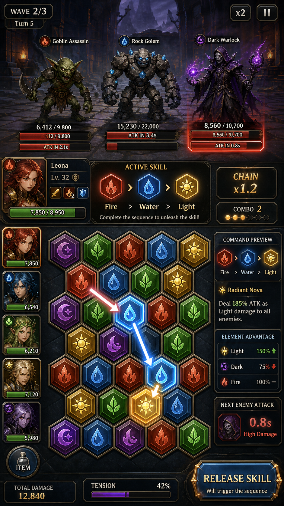
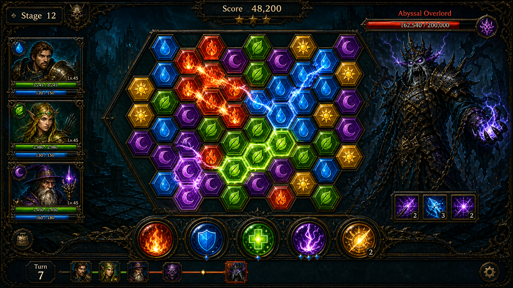
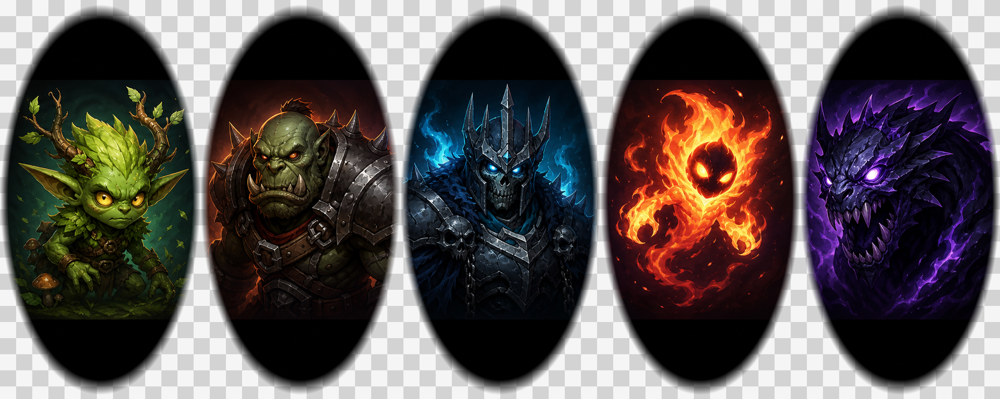

# ElementalCommand 기획서 v0.2

> 원소 속성 젬을 드래그해 시퀀스를 완성하고, 실시간으로 밀려오는 적을 물리치는 퍼즐 배틀 게임.

---

## 문제 정의

**어떤 유저가:** 모바일/PC 전략 게임을 즐기는 20~35세 코어 캐주얼 게이머

**어떤 상황에서:** 짧은 이동 시간이나 점심 시간(10~15분 세션), 또는 취침 전 가볍게 두세 판을 하고 싶을 때

**어떤 게임적 욕구를 원하는가:** 단순히 속성 상성을 "외우는" 것이 아니라, 매 턴 전장 상황을 읽고 어떤 원소 시퀀스를 선택할지 판단하는 **전술적 쾌감**을 원한다. 퍼즐의 손맛과 RPG 전투의 의미 있는 결과가 동시에 느껴지길 원한다.

---

## 주 페르소나

**이름:** 김재원 (가상)
**나이:** 28세
**직업:** IT 스타트업 개발자

**현재 게임 습관:**
- 퇴근 후 30분~1시간, 출퇴근 지하철에서 10분 내외로 플레이
- 퍼즐&드래곤즈류의 젬 매칭 + RPG 조합을 좋아했지만, 최근 비슷한 패턴에 질림
- "딱 한 판만 더"를 유발하는 짧고 긴장감 있는 전투를 선호

**이 게임을 플레이하는 맥락:**
- 복잡한 튜토리얼 없이 바로 전투 화면에서 무엇을 해야 하는지 직관적으로 파악
- 파티 편성→전투→결과 확인→재도전 사이클이 10분 안에 완결되어야 함
- 속성 상성과 스킬 시퀀스 조합을 스스로 발견하는 "아 이렇게 하면 되는구나" 순간을 즐김

---

## 핵심 루프

```
유저가 파티 4인을 편성 →
전투 화면에서 젬을 드래그해 원소 시퀀스 완성 →
아군 캐릭터가 순서대로 스킬 발동·적에게 속성 피해 →
적 실시간 공격 게이지가 차기 전에 처치 →
스테이지 클리어 후 보상 획득·다음 스테이지 해금 →
더 강한 적을 위한 새 파티 편성 검토 →
다시 "파티 편성"으로 돌아가 루프 시작
```

---

## 게임 소개

**ElementalCommand**는 헥사고날 퍼즐 보드 위에서 원소 젬(불·물·풀·빛·어둠)을 드래그해 아군 캐릭터의 스킬 시퀀스를 완성하고, 실시간으로 공격 게이지를 채우는 적들을 물리치는 퍼즐 배틀 게임이다.

한 번의 드래그 선택이 다음 장면의 위험도·보상·성장 방향으로 이어지는 구조가 핵심 매력이다.

---

## 주요 시스템

### 퍼즐 보드
- **형태:** 헥사고날 그리드 5열 × 6행
- **젬 종류:** 불(Fire), 물(Water), 풀(Grass), 빛(Light), 어둠(Dark) 5종
- **젬 스폰 확률:** 기본 각 20%, 파티 구성 캐릭터 속성에 따라 +5~10% 보정 (초과분은 나머지에서 균등 차감)

### 캐릭터 순환
- 아군 4명이 A→B→C→D→A 순서로 순환
- 드래그 종료마다 다음 캐릭터로 교체 (스킬 발동 여부 무관)
- 현재 활성 캐릭터는 시각적으로 강조 (전면 배치 또는 발광 효과)

### 적 실시간 공격
- 각 적은 개별 공격 타이머 보유
- 타이머가 차면 즉시 아군에게 공격 (별도 적 턴 없음)
- 적 공격 게이지를 UI에 실시간 표시

### 화면 흐름
1. **BootScene** — 에셋 로딩
2. **StageSelectScene** — 스테이지 선택
3. **PartySelectScene** — 파티 편성 (4인)
4. **BattleScene** — 핵심 전투 (HexBoard + Gem + Character)

---

## 핵심 재미

- **읽기 쉬운 상황 판단:** 현재 위험한 요소(적 게이지)와 얻을 수 있는 보상이 한눈에 들어온다.
- **직접적인 선택 피드백:** 드래그 완료 즉시 전투 결과·자원·성장 상태가 변해 손맛을 만든다.
- **누적되는 성장감:** 반복 플레이가 단순 재시작이 아니라 다음 전략의 재료로 이어진다.

---

## MVP 가설

| # | 핵심 기능 | 검증할 가설 | 검증 방법 |
|---|-----------|-------------|-----------|
| 1 | 젬 드래그 퍼즐 + 실시간 적 공격 | 젬 드래그로 스킬을 발동하고 적 게이지를 보는 긴장감이 있으면 플레이어는 한 판 후 자발적으로 재시작할 것이다 | 1회 플레이 후 재시작률 60% 이상 |
| 2 | 적 공격 게이지 실시간 표시 | 위험(게이지)과 보상(스킬 발동)이 동시에 보이면 선택 시간이 줄고 결과 납득도가 오를 것이다 | 주요 드래그 시작까지 평균 8초 이내, 결과 불만 피드백 20% 이하 |
| 3 | 파티 편성 선택 (4인) | 파티 편성이 젬 스폰 확률에 영향을 미친다는 것을 체감하면 3판 내 서로 다른 구성을 시도하게 될 것이다 | 3판 내 서로 다른 파티 구성 시도율 50% 이상 |
| 4 | 속성 상성 피해 배율 | 속성 상성이 전투 결과에 즉각 반영되면 플레이어가 상성 학습을 자발적으로 진행할 것이다 | 3스테이지 이후 상성 우위 젬 우선 드래그 비율 70% 이상 |

---

## 레퍼런스 분석

### 1. 퍼즐&드래곤즈 (GungHo, 2012)
- **핵심 행동까지 UX 단계:** 설치→튜토리얼→첫 던전 입장→드래그 조작 = **4단계, 약 3분**
- **특징:** 드래그로 젬을 이동시켜 3매치를 만드는 심플한 입력, RPG 성장과 결합
- **교훈:** 드래그 조작은 직관적이지만 첫 화면에서 "무엇을 드래그해야 하는지" 시각적 힌트가 없으면 이탈률이 높다. → ElementalCommand는 첫 전투에서 드래그 가능 영역을 명확히 강조한다.

### 2. Hearthstone (Blizzard, 2014)
- **핵심 행동까지 UX 단계:** 로그인→덱 선택→첫 턴 카드 플레이 = **3단계, 약 2분**
- **특징:** 카드 드래그 하나로 즉각적인 전투 결과 확인, 명확한 승패 조건
- **교훈:** 첫 의미 있는 선택 후 결과가 즉시 시각화되면 플레이어가 인과관계를 빠르게 학습한다. → ElementalCommand는 스킬 발동 시 속성 효과 이펙트와 피해 숫자를 즉시 표시한다.

### 3. Into the Breach (Subset Games, 2018)
- **핵심 행동까지 UX 단계:** 게임 시작→그리드 확인→첫 유닛 이동 = **2단계, 약 1분**
- **특징:** 적의 다음 행동이 미리 보여 계획을 세울 수 있는 투명한 정보 설계
- **교훈:** 적의 공격 타이밍을 명확히 보여주면 플레이어가 위기감과 전략적 판단을 동시에 느낀다. → ElementalCommand의 적 공격 게이지 실시간 표시는 이 원칙을 직접 적용한 것이다.

**공통 적용 교훈:** 규칙 설명보다 먼저 선택 가능한 상황을 보여주고, 결과 화면에서 다음 판의 개선 포인트를 바로 제안한다.

---

## 성공 KPI

| 지표 | 목표 수치 | 측정 방법 |
|------|-----------|-----------|
| 세션당 평균 플레이 시간 | **8분 이상** | 세션 시작~종료 타임스탬프 |
| 첫 세션 내 2회차 진입률 | **55% 이상** | 1회차 종료 후 재시작 이벤트 수 / 전체 1회차 완료 수 |
| D1 리텐션 (익일 재방문율) | **30% 이상** | 첫 플레이 후 24시간 내 재접속 유저 비율 |
| 레벨 3 스테이지 도달률 | **40% 이상** | 스테이지 3 입장 이벤트 수 / 전체 신규 유저 수 |
| 핵심 선택 화면 이탈률 | **15% 이하** | 파티 편성 화면 진입 후 전투 미시작 비율 |
| 속성 상성 인지율 | **70% 이상** | 3스테이지 이후 상성 우위 젬 드래그 비율 |

---

## 조작과 UX 원칙

- 주요 버튼은 44px 이상으로 유지하고, 화면당 CTA 강조색은 하나만 사용한다.
- 버튼/선택지는 한 번에 5개 이하로 노출해 판단 부담을 줄인다.
- 400ms 이내 조작 피드백 (젬 드래그 반응, 스킬 발동 이펙트)
- 로딩, 빈 상태, 에러, 많은 데이터, 긴 텍스트 상태를 각각 별도 처리
- HUD 동일 레이어 요소는 겹치지 않게 배치하고, 겹침이 필요한 효과는 별도 depth/z-order를 사용한다.

---

## 기술 스택

| 항목 | 선택 |
|------|------|
| 게임 엔진 | Phaser.js 3 |
| 언어 | JavaScript (ES Modules) |
| 빌드 | Vite |
| 모바일 확장 | Capacitor (예정) |
| 데스크톱 확장 | Electron (예정) |

---

## 비주얼 방향

- 다크 마법 전장 배경 + 판독성 높은 대비
- 원소 젬: 폴리싱된 판타지 스톤 느낌 (단순 색상 헥스가 아닌)
- 캐릭터 카드: 포트레이트 아트, 원소 프레임, 스킬 아이덴티티 명확화
- 적 슬롯: 몬스터 포트레이트, 강화된 HP 바, 공격 게이지 명확 표시
- 스킬 발동 시 속성별 임팩트 이펙트

---

## 현재 개발 상태 (2026-06-24 기준)

| 항목 | 체감 진행률 |
|------|------------|
| 핵심 루프 구현 | ~50% |
| 첫 세션 루프 전달 가능성 | ~56% |
| UI/리소스 일관성 | ~46% |
| 콘텐츠·반복 플레이 분량 | ~46% |
| 빌드/실행 안정성 | ~40% |

> 실제 플레이 테스트 후 ±15%p 보정 필요

---

## 남은 리스크와 다음 우선순위

1. 첫 화면에서 게임의 목표와 다음 행동이 5초 안에 보이는지 확인
2. 주요 선택의 결과 예측과 실제 결과가 어긋나는 지점을 플레이 테스트로 수집
3. 적 공격 게이지 표시가 실시간 긴장감을 충분히 전달하는지 검증
4. 파티 편성이 젬 스폰 확률에 영향을 준다는 것을 플레이어가 체감하는지 확인

---

## 빌드 및 테스트

```bash
npm test         # npx vitest run
npm run build    # npx vite build
```

---

## 공유용 이미지 미리보기





---

## 개선 제안

> 아래 제안은 현재 기획을 바탕으로 도출한 우선순위별 개선 방향입니다.

### 게임플레이 / 핵심 기능
| 우선순위 | 제안 | 기대 효과 |
|---------|------|---------|
| 높음 | 전투 결과 화면에서 "이번 판 최고 시퀀스"와 "놓친 상성 조합"을 자동으로 하이라이트 표시 | 결과 납득도 상승 + 다음 판 전략 힌트 제공으로 재시작률 60% 목표 달성 가속 |
| 높음 | 드래그 중 현재 선택된 젬 시퀀스가 발동할 스킬 데미지 예상치를 실시간 오버레이로 표시 | 선택-결과 인과관계 즉시 체감 → 첫 드래그 시작까지 평균 8초 이내 KPI 달성 |
| 중간 | 3판 연속 패배 시 "이 스테이지 추천 파티 힌트" 팝업 노출 (속성 조합 1가지만 제시) | 무한 이탈 방지 + 파티 편성 다양성 시도율 50% KPI 달성 보조 |
| 중간 | 캐릭터 순환 순서를 전투 전 드래그로 변경 가능한 "순서 편집" 기능 추가 | 파티 편성의 전술 깊이 증가, 3회차 이후 재편성 동기 부여 |
| 낮음 | 일일 도전 스테이지(제한 파티 구성 조건) 추가 — 예: "불 속성 캐릭터 2인 이상 필수" | 매일 새로운 제약 조건으로 "오늘만의 퍼즐" 제공, D1 리텐션 30% 목표 지원 |

### UX / UI
- **첫 전투 진입 시 조작 불명확:** 헥사 보드 위 첫 유효 젬 위치에 박동 애니메이션과 "여기서 드래그 시작" 화살표 오버레이를 3초간 표시한 뒤 자동 사라지게 처리 — 퍼즐&드래곤즈 레퍼런스에서 도출한 이탈 방지책
- **캐릭터 순환 직관성 부족:** 현재 활성 캐릭터 강조 외에, 다음 순서 캐릭터 슬롯에 "NEXT" 뱃지와 낮은 투명도를 적용해 순환 구조를 한눈에 인지하도록 개선
- **적 공격 게이지 긴박감 부족:** 게이지 70% 이상 시 게이지 바 색상을 주황→빨강으로 변경하고 화면 가장자리에 얕은 붉은 빛을 추가 — 시각적 경보로 판단 가속 유도
- **파티 편성 화면 이탈률 15% 문제:** 캐릭터 선택 시 해당 속성의 젬 스폰 확률 변화를 즉시 미리보기로 보드 상단에 표시 — "고르면 이렇게 바뀐다"는 즉각 피드백 제공

### 수익화 전략
- **코스메틱 젬 스킨:** 원소별 젬 비주얼(파이어 → 용암석, 워터 → 수정구 등) 스킨 팩 판매. 젬은 화면 내 가장 많이 보이는 오브젝트이므로 구매 동기가 높고, 밸런스에 영향을 주지 않아 코어 유저 반발이 없음
- **스테이지 팩 DLC:** 스토리 챕터 1~3은 무료, 4챕터 이후는 일회성 결제로 해금. 코어 캐주얼 타겟의 "가벼운 소비" 패턴에 적합하며 광고 모델보다 플레이 흐름을 깨지 않음
- **시즌 패스(배틀패스):** 월 단위 미션(예: "불 속성 시퀀스 50회 완성")을 통해 전용 캐릭터 포트레이트 프레임 및 스테이지 테마 해금. 재방문율 지표(D1 리텐션 30%)에 직결되는 장기 참여 유도 구조

### 콘텐츠 확장
- **단기(1~2개월):** 보스 스테이지 추가 — 전투 중 보스가 게이지 만충 시 전체 공격 대신 특정 속성 젬을 잠금(Locked Gem) 상태로 만드는 특수 패턴 도입. 현재 헥사 보드 시스템 위에 젬 상태 플래그만 추가하면 구현 가능
- **중기(3~6개월):** 원소 융합 스킬 시스템 — 2가지 이상 속성 젬을 연속 드래그하면 "불+물=증기 폭발" 같은 복합 스킬이 발동하는 체인 메커니즘 추가. 기존 시퀀스 루프를 확장하는 형태라 코어루프를 깨지 않음
- **장기(6개월+):** 비동기 PvP — 상대 파티의 지난 전투 시퀀스 패턴을 AI로 재현해 방어 진형으로 배치, 내 젬 선택으로 그 패턴을 깨는 구조. 실시간 매칭 서버 없이 비동기 전투 데이터만 교환해 인프라 부담 최소화

### 기술적 개선
- **젬 스폰 시드 재현:** 전투 시작 시 랜덤 시드를 기록해 리플레이·버그 재현이 가능하도록 개선. 현재 개발 안정성 40% 수준에서 QA 효율을 크게 높이고 플레이 데이터 분석 기반 마련
- **Phaser Scene 메모리 관리:** BattleScene 전환 시 Gem/Character 객체를 scene.shutdown 이벤트에서 명시적으로 destroy() 호출하지 않으면 재시작 누적 시 메모리 누수가 발생함. 각 Scene에 shutdown 핸들러를 추가하고 Phaser DevTools로 오브젝트 카운트를 모니터링할 것
- **Capacitor 모바일 전환 준비:** 터치 이벤트와 마우스 이벤트를 공통 Pointer 추상 레이어로 통일해두면 Capacitor 빌드 전환 시 조작 코드 수정 없이 배포 가능. 헥사 드래그 입력부터 적용 시작 권장
- **스테이지 데이터 JSON 외부화:** 현재 하드코딩 추정되는 스테이지 구성(적 종류·타이머·배치)을 `/src/data/stages.json`으로 분리하면 기획자가 코드 변경 없이 밸런스 조정 가능하고 콘텐츠 확장 속도가 3배 이상 빨라짐

---

## 2026-06-28 v0.2.1 비주얼 리소스 갱신

전투 씬 배경 `public/assets/bg-battle.png`를 동일 크기 941x1672 PNG로 교체했다. `AssetManifest`의 `asset-bg-battle` 경로와 `BattleScene`의 `bg-battle` 키를 그대로 유지하면서 원소 전투 화면의 수직 배경 밀도와 마법 전장 질감을 강화했다. 원본은 `_temp/bg-battle_backup_20260628.png`, 생성 후보는 `_temp/bg-battle_source_20260628.png`에 보관한다.

## 2026-06-29 v0.3.1 Command Matchup Feedback

- BattleScene now shows a command matchup preview under the skill tray before the player acts.
- The preview names the best enemy counter target, shows weakness counters before and after the selected command, and states the next tactical implication.
- After a drag resolves, the same panel reports the resolved skill/basic command result against the updated enemy weakness state.
- Pure helper coverage was added in `CombatBoard.test.js` for advantage preview, weakness break preview, and neutral/no-counter feedback.
- Runtime audit: this batch added functional text feedback only. Existing Phaser graphics/circle/rectangle usage remains UI state, bars, rings, and progress indicators; no new SVG or code-drawn elemental icon resource was introduced.


## v0.3.1 UI/HUD 개선
- 전투 HUD를 SKILL SELECTION과 COMMAND PREVIEW 두 그룹으로 분리해 스킬 선택 상태와 결과 예측이 한 문장에 섞이지 않도록 정리했다.
- uildBattleHudGroups 테스트를 추가해 선택/미리보기 그룹의 역할과 문구를 검증한다.
